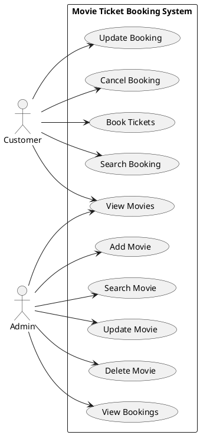
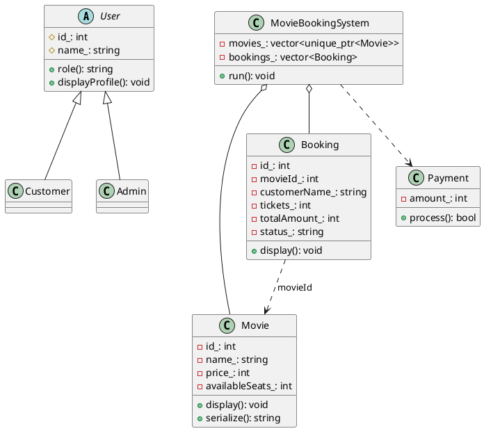
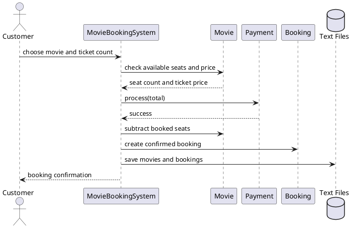
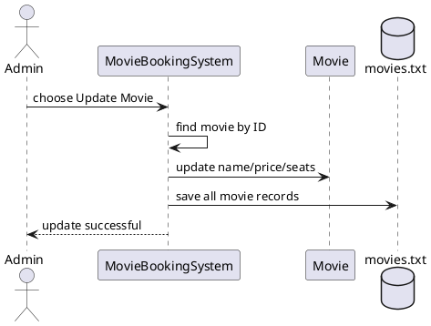

# Movie Ticket Booking System (C++17)

## Features
- Seven classes: `Movie`, abstract `User`, `Customer`, `Admin`, `Booking`, `Payment`, `MovieBookingSystem`.
- Constructors/destructors, inheritance, virtual functions, runtime polymorphism.
- Dynamic memory through `std::unique_ptr` and `std::make_unique`.
- File persistence: `movies.txt` and `bookings.txt` are created in the current working directory.
- Movie CRUD: add, search, update, delete.
- Booking operations: book, search, update ticket count, cancel, list.
- Booking transaction validates ticket count and available seats, calculates amount, and saves data.
- Includes comments linking this implementation to the checklist.

## Compile and run
### Windows (MinGW g++)
```bash
g++ -std=c++17 -Wall -Wextra -pedantic main.cpp -o movie_booking.exe
movie_booking.exe
```

### Linux/macOS
```bash
g++ -std=c++17 -Wall -Wextra -pedantic main.cpp -o movie_booking
./movie_booking
```

The executable is generated by the compile command; it is not portable between operating systems, so compile it on the target machine.

## Data files
The application automatically loads and saves:
- `movies.txt`
- `bookings.txt`

Back up these files if you need to preserve your demonstration data. They are simple text files, not encrypted databases.

## Important project limitations
- Payment is simulated; it does not charge a real card or UPI account.
- Admin menu is for an academic demonstration and has no password authentication.
- Booking update adjusts seats and totals but does not implement real refunds or payment collection.
- This is a console application, not an online multi-user booking platform.
- Do not edit the data files while the program is running.

## Use Case Diagram (PlantUML)


## Class Diagram (PlantUML)


## Sequence Diagram 1: Book tickets (PlantUML)


## Sequence Diagram 2: Admin updates a movie (PlantUML)

